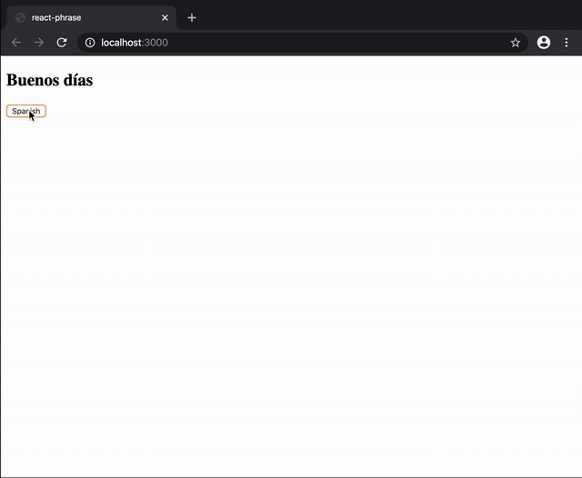

<p align="center">
  <a href="https://www.npmjs.com/package/react-phrase" target="blank"></a>
</p>

# react-phrase

> Internationalization for react apps

[](https://www.npmjs.com/package/react-phrase) [](https://standardjs.com)



## [Demo](https://codesandbox.io/embed/vigilant-darkness-9fnwn?fontsize=14&hidenavigation=1&theme=dark)

## Install

```bash
npm install --save react-phrase
```

## Usage

### Provider

```tsx
import React, { Component } from "react";
import Provider from "react-phrase";

import Child from "./Child";

const en = {
	"Good morning": "Good morning"
};

const es = {
	"Good morning": "Buenos días"
};

export default class App extends Component {
	state = {
		lang: "en"
	};

	render() {
		const { lang } = this.state;
		return (
			<Provider phrases={{ en, es }} lang={lang}>
				<Child
					onLangChange={() =>
						this.setState({ lang: lang === "en" ? "es" : "en" })
					}
				/>
			</Provider>
		);
	}
}
```

#### Props

| prop    | type   | default | required |
| ------- | ------ | ------- | -------- |
| phrases | Object | {}      | true     |
| lang    | string | en      | false    |
|         |        |         |          |

> Note: `lang` props will always fallback to locale.

### Child

`translate` function will be injected via `Props`

```tsx
import React from "react";
import { withTranslate } from "react-phrase";

interface Props {
	translate: (phrase: string, options?: any) => string;
	onLangChange: () => void;
}

const Child = ({ translate, onLangChange }: Props) => {
	return (
		<div>
			<h2>{translate("Good morning")}</h2>
			<button onClick={() => onLangChange()}>Spanish</button>
		</div>
	);
};

export default withTranslate(Child);
```

> Note: `translate` function has `options` as 2nd argument, you could pass an object with your keys if you have variable inside your message, check below:

```jsx
	const es = {
		"Hello %{name}":"Hola %{name}",
	}
	....
	<h2>{translate("Hello %{name}")}</h2>

```

### Hooks

Without HOC(wihtTranslate) You could use a hook `useTranslate` to get translate values.

```jsx
import React, { useState } from "react";
import { useTranslate } from "react-phrase";

const en = {
	"Good morning": "Good morning"
};

const es = {
	"Good morning": "Buenos días"
};

export const MyComponent = () => {
	const [lang] = useState("es");
	const translate = useTranslate({ en, es }, lang);

	return <div>{translate("Good morning")}</div>;
};

```

#### `useTranslate` Props

| prop    | type   | default | required |
| ------- | ------ | ------- | -------- |
| phrases | Object | {}      | true     |
| lang    | string | en      | false    |
|         |        |         |          |

> Note: `lang` props will always fallback to locale.

## License

MIT © [musti-91](https://github.com/musti-91)
